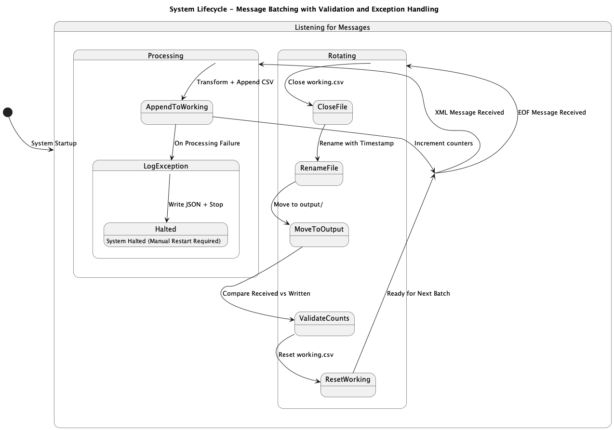
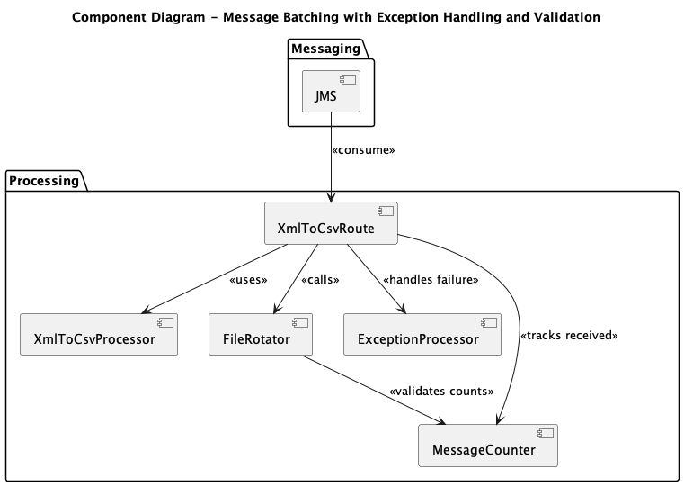
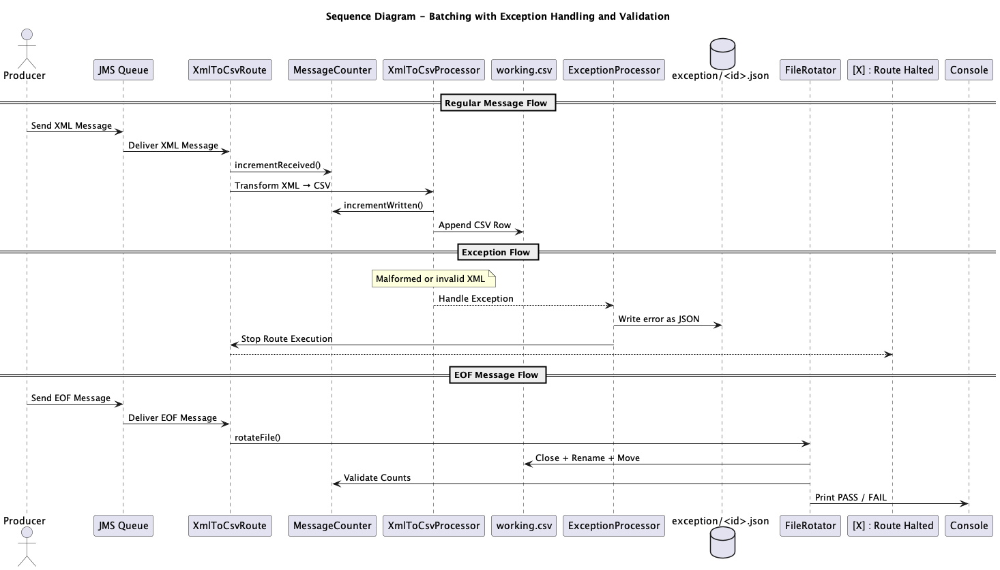
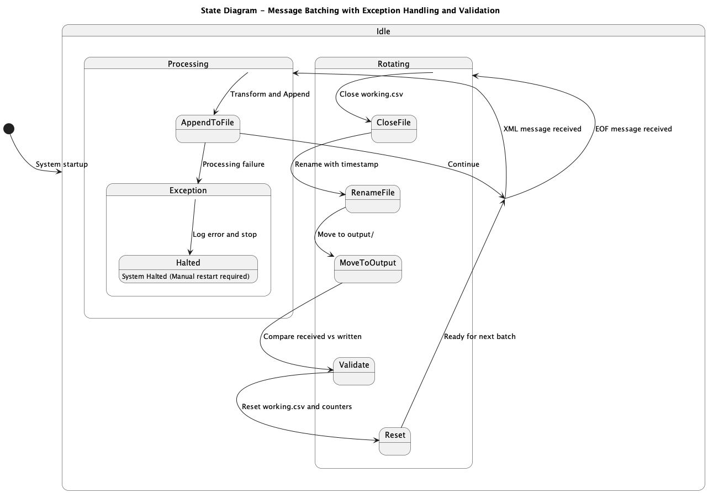
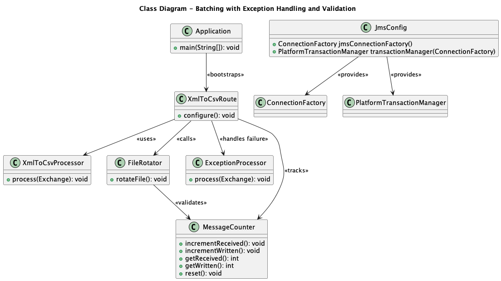

# Batching JMS Messages to File

## Introduction

## Introduction

This document presents the **design and implementation** of a Spring Boot + Apache Camel application that ingests messages from a JMS queue, transforms them into CSV format using rules defined in an external `descriptor.json` file, and writes them to a file. Messages are grouped into batches based on EOF signals and processed in a transactionally safe and restartable manner.

In case of a processing failure, the system logs the failed message and exception details to a structured JSON file and halts further processing. This ensures that failures are visible, recoverable, and that no message is skipped or duplicated.

To further enhance reliability, the system validates that the number of XML messages received matches the number of messages written to the output file. This count validation occurs at the time of file rotation and is printed to the console to confirm message integrity.

Apache Camel coordinates the routing, transformation, and fault-handling logic, while Spring Boot provides the runtime infrastructure and configuration management.

## Design

### Requirements

- Ingest XML messages from a JMS queue in FIFO order.
- Convert each message to a CSV format based on configured field mappings.
- Continuously append messages to a working file.
- Finalize the file upon receiving an EOF message:
  - Close the working file.
  - Rename it with a timestamp.
  - Move it to an output directory.
  - Begin a new working file.
- Ensure transactional delivery and resume operations correctly after failures.
- Capture and log unrecoverable message processing exceptions to a structured file.
- Stop the application immediately on failure, requiring manual intervention and restart.
- **Validate** that the number of XML messages received matches the number of CSV records written at the time of file rotation, and report the result to the console.

### System Workflow

The message batching system processes messages through a defined lifecycle:

1. Listens for JMS messages continuously.
2. If a message is a regular XML message, it is transformed to a CSV row and appended to the `working.csv`. Each message is counted for validation purposes.
3. If a message is marked as EOF, the system:
   - Closes the current working file.
   - Appends a timestamp to the filename.
   - Moves it to the output directory.
   - Clears the working file for future messages.
   - **Performs a validation check** to compare the number of messages received and successfully written, and prints the result (PASS or FAIL) to the console.
4. If a processing exception occurs:
   - The original message and stack trace are written to a structured JSON file in the `exception/` folder.
   - The system halts further processing and requires a manual restart.

This workflow guarantees that each batch is uniquely identified and separated by EOF delimiters. It also ensures that message integrity is preserved in both normal and failure scenarios.




### Component Model

The system is composed of seven primary components, as illustrated in the Component Diagram below:

- **JMS (top of the diagram)**: The message ingestion layer that continuously receives messages from a JMS queue. It acts as the entry point into the system.

- **XmlToCsvRoute**: The routing mechanism responsible for consuming JMS messages and directing them to the appropriate internal processing path. It distinguishes between standard XML messages and EOF signals.

- **XmlToCsvProcessor**: The transformation component that receives regular XML messages from the route and converts them into CSV rows using rules defined in the descriptor.

- **FileRotator**: The file management component responsible for handling EOF events. It closes the current file, renames it with a timestamp, moves it to the output directory, and resets the working file. It also performs message count validation at the end of each batch.

- **ExceptionProcessor**: A component that handles unrecoverable processing failures by logging the offending message and stack trace to a structured JSON file in the `exception/` directory and stopping the route.

- **MessageCounter**: A shared stateful component used to track the number of XML messages received and successfully written. It supports end-of-batch validation to ensure that no messages were lost or skipped during transformation and writing.

- The **transactional context** is implicitly enforced across the interactions between these components, ensuring that messages are processed exactly once—from ingestion to file write or rotation—before they are acknowledged.

Each component plays a vital role in ensuring that message ingestion, transformation, batching, and validation operate in a reliable and consistent manner, with built-in support for failure visibility and recovery.



### Sequence Diagram

The sequence diagram illustrates how the system components interact to fulfill the message batching requirements, including both normal and exceptional processing paths.

- A producer sends either regular XML messages or EOF signals to a JMS queue.

- The **ingestion component** consumes the messages from the queue.

- Based on the message type, the **routing mechanism** directs the message to either:
  - the **transformation component** for regular XML messages, or
  - the **file management component** for EOF messages.

- Regular XML messages are:
  - Counted using the **MessageCounter**.
  - Transformed into CSV rows.
  - Appended to `working.csv`.
  - Counted again after successful write.

- If an exception occurs during processing, the **ExceptionProcessor** is invoked to:
  - Log the failed message and stack trace into a structured JSON file in the `exception/` directory.
  - Immediately halt further processing.

- EOF messages trigger the **file management component**, which:
  - Closes the current file.
  - Appends a timestamp to its name.
  - Moves it to the output directory.
  - Invokes the **MessageCounter** to compare the received and written counts.
  - Prints the result of the validation (PASS or FAIL) to the console.
  - Clears the working file to begin a new batch.

This interaction flow ensures strict message ordering, validation of message integrity, reliable fault reporting, and clean batch finalization upon EOF detection.




### State Diagram

The state diagram illustrates how the system transitions between its internal operational states during message processing:

- The system begins in an **idle state**, continuously waiting for incoming JMS messages.

- When an XML message is received, it transitions to a **processing state**, where the message is transformed and appended to the working file. Message counters are updated for validation.

- If an EOF message is received, the system enters a **rotating state**, where it:
  - Finalizes the current file by closing, renaming, and moving it to the output directory.
  - Performs a **validation check** comparing the number of XML messages received with the number of CSV records written.
  - Logs the validation result (PASS or FAIL) to the console.
  - Resets the message counters.

- If an unrecoverable exception occurs during processing, the system transitions to an **exception state**, where it logs the original message and full stack trace to a structured JSON file in the `exception/` directory and halts further processing.

- After successful rotation (or a manual restart following an exception), the system returns to the **idle state**, ready to process the next batch.

This state-driven architecture ensures reliable operation, validates message integrity, and supports controlled failure handling and recovery.



### Descriptor

The `descriptor.json` file serves as a centralized configuration resource that decouples transformation logic from the application code. Its primary goal is to provide flexibility in how XML messages are interpreted and how output files are formatted—making the system adaptable without requiring redeployment.

In our case, the file enables runtime customization of:

- Fields to extract from incoming XML messages.
- CSV delimiter and header format for output files.
- File output paths and timestamp-based naming conventions.

By externalizing these transformation rules, the system can evolve to support new message structures or formatting requirements without modifying or recompiling source code.

Note: The descriptor governs transformation logic only. Exception handling, logging, and control flow behavior are built into the route and not configured via this file.

## Implementation

### Approach

Apache Camel routes orchestrate the flow of messages from the JMS queue to the file system. Camel ensures transactional safety by wrapping the message processing inside a JMS transaction. A message is acknowledged only if all downstream steps — including transformation and file writing — succeed.

If an unrecoverable exception occurs (e.g., transformation failure due to malformed XML), the system:
- Logs the original message and full exception stack trace as a JSON file in the `exception/` directory.
- Aborts processing by explicitly stopping the route.
- Requires manual intervention and restart before further messages are consumed.

To further ensure message integrity, the system maintains counters for the number of XML messages received and the number of records successfully written. At the end of each batch (triggered by an EOF message), the system:
- Compares the two counters,
- Logs the result (PASS or FAIL) to the console,
- Resets the counters for the next batch.

This fail-fast and validate-late behavior ensures that:
- Failures are immediately visible and auditable.
- No messages are skipped or duplicated.
- Data integrity is confirmed before the system begins processing a new batch.

The system also differentiates between a normal restart and a crash recovery by tracking message state and file output. In both cases, it resumes safely without reprocessing completed messages or corrupting partially written batches.

### Class Diagram

The class diagram below visualizes the internal structure of the application, highlighting how key components interact to achieve message transformation, file-based batching, structured error handling, and validation.

At the core of the system is the routing logic (`XmlToCsvRoute`), which controls the flow of messages after they are consumed from the JMS queue. Based on message content and processing success, the route delegates to one of three downstream components:

- A transformation component (`XmlToCsvProcessor`) that performs `XML-to-CSV` conversion based on the rules in `descriptor.json`.
- A file management component (`FileRotator`) that handles the EOF signal, manages file closure, renaming, archival, and performs final batch validation.
- An exception-handling component (`ExceptionProcessor`) that logs unprocessable messages and their stack traces to a structured JSON file and halts the system.

The system also includes a message tracking component (`MessageCounter`) that is shared across routes. It keeps a running count of the number of XML messages received and successfully written. This count is validated at the end of each batch to confirm data consistency.

JMS connectivity and transactional safety are configured centrally in the `JmsConfig` class, which provides Spring-managed beans to ensure that each message is processed exactly once and acknowledged only upon successful completion.

This architecture ensures reliable end-to-end processing, data validation, safe recovery, and traceable fault reporting.




### Class Descriptions

### 🧾 Class Descriptions

- **`Application`** – Bootstraps the Spring Boot application and initializes the Apache Camel context, which runs the defined message processing routes.

- **`JmsConfig`** – Declares Spring beans for the `JMS ConnectionFactory` and `PlatformTransactionManager`, enabling reliable, transactional consumption of messages from the JMS queue.

- **`XmlToCsvRoute`** – Defines the central Apache Camel route. It listens to the JMS queue, classifies messages as either regular XML or EOF, and delegates them to the appropriate downstream component. It also manages exception detection and invokes error-handling routines when needed. During processing, it tracks message statistics using `MessageCounter`.

- **`XmlToCsvProcessor`** – Performs the transformation of incoming XML messages into CSV format. Field mappings and delimiter settings are driven by the external `descriptor.json` file, allowing flexibility without code changes.

- **`FileRotator`** – Handles EOF-triggered file lifecycle operations:
  - Closes the active `working.csv` file.
  - Appends a timestamp for traceability.
  - Moves the completed file to the `output/` directory.
  - Resets the working file and message counters.
  - Compares the number of received vs. written messages using `MessageCounter` and logs a PASS or FAIL result to the console.

- **`ExceptionProcessor`** – Responsible for structured error handling. When a message cannot be processed:
  - It logs the original message and full exception stack trace to a uniquely named JSON file in the `exception/` directory.
  - It stops the route to prevent further processing until the issue is manually resolved.

- **`MessageCounter`** – A shared, thread-safe component used to track message statistics. It:
  - Increments a count when each XML message is received.
  - Increments a separate count when a CSV row is successfully written.
  - Provides a validation mechanism to compare the two counts at the end of each batch.
  - Supports automatic reset after validation to prepare for the next batch.

## Running the Project

1. Start ActiveMQ Artemis on `localhost:61616`.
2. Run the project using:

```bash
mvn spring-boot:run
```

3. Ensure that the following folders exist:
   - `working/`
   - `output/`


## Testing

This section describes functional test scenarios that validate the system’s behavior using simplified XML inputs. While the examples provided here are minimal for demonstration purposes, they reflect the same flat structure used in production, where XML messages are not nested and follow a predictable tag-based schema.

The transformation logic in both test and production environments is governed by the external `descriptor.json` file. This makes it easy to adapt the system to production data simply by updating the descriptor—no changes to the code are required. This decoupling ensures seamless transitions from test to production configurations while maintaining consistent processing behavior.

In addition to validating normal flow behavior, the system also supports structured exception handling. If a message fails during processing—such as due to a missing XML tag—the system logs the message and the exception details as a JSON file in the `exception/` folder and stops processing. This behavior ensures visibility and recoverability for operational failures.

To further ensure integrity, the system performs validation at the end of each batch. It compares the number of XML messages received with the number of CSV rows successfully written to the output. The result of this validation is printed to the console as either `PASS` or `FAIL`. This feature is especially useful in high-volume or regulated environments where message completeness must be guaranteed.

Scenarios in this section cover:
- XML message transformation and file writing
- File rotation triggered by EOF
- Exception handling and route termination
- Validation of message count accuracy during batch finalization

### Test Inputs

**Regular XML Message**
```xml
<message>
  <id>101</id>
  <name>Test User</name>
  <value>30</value>
</message>
```

**EOF Message**
```xml
<message>
  <type>EOF</type>
</message>
```

**Malformed XML Message**
```xml
<message>
  <id>102</id>
  <value>Missing name tag</value>
</message>
```

### Test Scenarios

This section describes a series of functional tests designed to validate the system's behavior across various operational scenarios. Each test case includes input data and the expected system response.

These scenarios confirm that the system correctly handles message transformation, batching, EOF detection, crash recovery, and structured exception logging. They ensure the system behaves reliably under both normal and failure conditions.

#### ✅ Scenario 1: System Start

**Input**:  
- No messages present in the JMS queue.

**Expected Output**:  
- The system initializes and waits for incoming messages.
- No output files are created.
- Logs indicate that the system is polling and ready to process new input.


#### ✅ Scenario 2: XML Processing

**Input**:
```xml
<message>
  <id>201</id>
  <name>Test A</name>
  <value>50</value>
</message>
```

**Expected Output**:

 - `working.csv` is created if it doesn’t already exist.

 - A new CSV row is appended:

```json
201,Test A,50
```

 - The message is acknowledged and removed from the JMS queue.


#### ✅ Scenario 3: EOF Handling

**Input Sequence**:

1. One or more XML messages (e.g. regular business data)

2. EOF message:

```xml
<message>
  <type>EOF</type>
</message>
```
**Expected Output**:

 - The current `working.csv` is finalized and closed.

 - It is renamed using a timestamp (e.g., `output_20250420_153012.csv`).

 - The file is moved to the `output/` directory.

 - The working file is reset and ready for a new batch.

  - Logs confirm that rotation and archival were completed successfully.

#### ✅ Scenario 4: Complete Batch Flow

**Input Sequence**:

```xml
<message><id>1</id><name>Alice</name><value>100</value></message>
<message><id>2</id><name>Bob</name><value>200</value></message>
<message><type>EOF</type></message>
```

**Expected Output**:

 - `working.csv` will contain:

```json
1,Alice,100
2,Bob,200
```

Upon receiving the EOF:

 - File is renamed and moved to `output/output_<timestamp>.csv`

 - `working.csv` is reset for the next batch

 - Processing continues without interruption

 
#### ❌ Scenario 5: Crash Recovery

The system crashes after processing some XML messages but before receiving the EOF.

Expected Behavior After Restart:

 - The system resumes message consumption from where it left off.

 - Already processed messages are not duplicated.

 - Data in working.csv remains intact.

 - Once EOF is received, the batch is finalized as usual.

 - No data loss or corruption occurs.


#### ❌ Scenario 6: Transformation Failure – Missing Field

**Input Sequence**:

```xml
<message>
  <id>3</id>
  <value>999</value>
</message>
```

(*The <name> tag is missing, which is required by the transformation rules.*)

**Expected Output**:

 - The system attempts to transform the message but throws an exception due to the missing <name> element.

 - A new file is written to the exception/ directory:

    - Filename: {exchangeId}.json
    - Contents:

    ```json
    {
      "messageId": "auto-generated-id",
      "messageBody": "<message><id>3</id><value>999</value></message>",
      "stackTrace": "java.lang.NullPointerException ..."
    }
    ```
## 📈 Monitoring and Validation

The initial release of the system focuses on ensuring consistency between the number of XML messages received from the JMS queue and the number of records successfully written to the output CSV file. This validation occurs in real time during the file rotation step triggered by an EOF message.

Upon rotation, the system:
- Compares the count of received messages against the count of successfully written CSV rows.
- Logs the result to the console in the form of:

    Received XML Messages: 10
    Written CSV Records: 10
    Validation: ✅ PASS

If the counts do not match, the system logs a `FAIL` message instead, highlighting a discrepancy in batch integrity. These logs help support teams immediately detect data loss or misprocessing.

### ✅ Test Case: Message Count Mismatch

**Scenario**: One of the incoming XML messages causes a transformation exception.

**Input**:
```xml
<message>
<id>101</id>
<name>Valid User</name>
<value>50</value>
</message>
<message>
<id>102</id>
<!-- missing <name> tag -->
<value>75</value>
</message>
<message>
<type>EOF</type>
</message>
```

**Expected Behavior**:

 - The first message is processed and appended.

 - The second message throws an exception and is logged to exception/.

 - The route is stopped immediately after the exception.

 - The validation step is not performed because the system is halted before EOF is processed.

### Future Monitoring Enhancements

Upcoming releases will expand monitoring and validation capabilities with integration into Dynatrace, including:

 - Live message throughput dashboards

 - Per-batch success/failure summaries

 - Transformation error rates

 - 	File integrity and volume trends

 - Batch processing delays

 - Unexpected EOF frequency

These enhancements will offer production-grade observability and proactive incident detection.

---

© 2025 Example Inc. All rights reserved.
---
