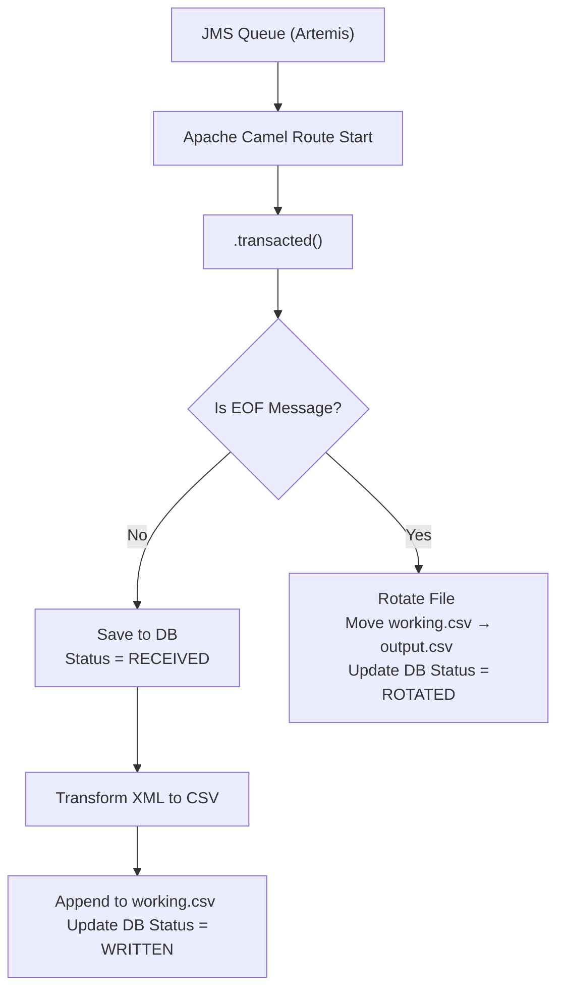
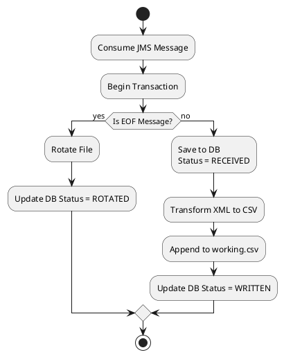

# 🛡️ Maintaining State in Transactional Message Processing on Kubernetes: Memory vs EFS vs Database

When building message-driven applications on Kubernetes — such as systems that transform JMS messages into files — maintaining **state consistency** is essential. Whether you're consuming, transforming, or loading messages into output files, the method you use to **persist state** defines your system’s **reliability, recoverability, and auditability**.

This article evaluates three common strategies for maintaining state in a transactional pipeline consisting of:

- **Message Consumption**
- **Transformation**
- **CSV Output (Load)**

We'll compare:

- **In-Memory State**
- **Amazon EFS (Elastic File System)**
- **Database-backed State (e.g., H2, PostgreSQL, Amazon RDS)**

---

## ⚙️ Transactional Flow Assumption

A well-structured pipeline includes:

```
JMS Queue (Artemis)
    ↓
[ Camel Route: .transacted() ]
    ↓
Transform XML → CSV
    ↓
Append to working.csv
    ↓
On EOF → rotate file
```

---

## 📊 Transactional Flow (Mermaid TD)



---

## 🗺️ Transactional Flow (PlantUML)



---

## 🧠 Option 1: In-Memory State

### ✔️ Description:
State exists only in local memory. No files or databases are used to track message status.

### ✅ Pros:
- Simplest to implement
- Fastest access
- No external dependencies

### ❌ Cons:
- **Lost on crash or restart**
- **No audit trail**
- **Not recoverable**: all messages must be re-sent

---

## 📁 Option 2: EFS-Based File Persistence

### ✔️ Description:
`working.csv` is written to an EFS volume shared between Pods. Files persist even if the Pod crashes or restarts.

### ✅ Pros:
- File data survives restarts
- Suitable for shared/multi-Pod setups
- Durable and scalable

### ❌ Cons:
- Doesn’t track what’s processed
- If app crashes after consuming JMS but before writing to EFS, message is lost
- No way to resume or skip based on file content
- No transactional rollback support

---

## 🗄️ Option 3: Database-Backed State

### ✔️ Description:
Each message is stored in a database with its processing status (`RECEIVED`, `WRITTEN`, `ROTATED`). Camel route checks DB before writing to file and after file append.

### ✅ Pros:
- Full crash recovery
- JMS + file + DB transactions can be coordinated
- Idempotency: no double processing
- Messages can be audited, replayed, or skipped

### ❌ Cons:
- Slightly more complex
- Requires database integration
- Adds operational overhead

---

## ⚖️ Comparison Table

| Feature / Option                    | In-Memory   | EFS Only    | DB-Backed       |
|------------------------------------|-------------|-------------|-----------------|
| Survives Pod Crash                | ❌ No       | ✅ Yes      | ✅ Yes          |
| Resume Processing After Crash     | ❌ No       | ❌ No       | ✅ Yes          |
| Transactional Integrity           | ✅ JMS only | ✅ JMS only | ✅ End-to-End   |
| Prevent Duplicate File Rows       | ❌ No       | ❌ No       | ✅ Yes          |
| Supports Replay / Retry           | ❌ No       | ❌ No       | ✅ Yes          |
| Audit Trail                       | ❌ No       | ❌ No       | ✅ Yes          |

---

## 🧭 Recommendation

| Use Case                            | Recommended Option      |
|-------------------------------------|--------------------------|
| Lightweight testing                | In-Memory                |
| Batch-like pipelines               | EFS                      |
| Transactional message → file flow  | DB + EFS                 |
| Restart-safe + resumable system    | DB                       |
| Regulated or auditable environments| DB + EFS                 |

---

## ✅ Conclusion

To build a resilient and auditable system in Kubernetes for JMS-based file processing pipelines, **EFS alone is not enough**. While EFS ensures that files persist, it does not offer state awareness or transactional rollback.  

For systems that require crash recovery, message tracking, and guaranteed delivery semantics, **a database-backed state model** is essential — particularly when used in conjunction with transactional JMS and durable file storage like EFS.
